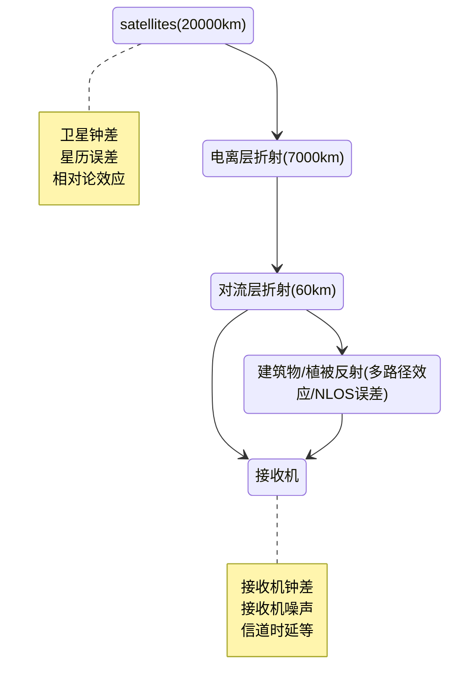

卫星导航定位的本质原理其实就是简单的后方交会，但由于空间尺度变大，我们不是在方圆十里内进行测量，而是数万公里外用卫星进行观测。距离变远，误差量级也自然增大。从最简单的伪距单点定位（Single Point Positioning, SPP），到差分定位（Precise Point Positioning, RTK为代表），再到精密单点定位（Precise Point Positioning, PPP），对于误差的消除和改善也有所不同。

## 一、伪距单点定位（SPP）中的误差

SPP采用测量伪距观测值（C/A码或P码）进行定位，是卫星导航定位系统中最简单、最直接的定位方式，一般只能达到十几米或几十米甚至更差的精度。所以SPP中的误差基本也“最全面”。关于SPP的原理可以参考之前的blog[**The process and principle of SPP**](https://233yun.github.io/posts/the-process-and-principle-of-spp/)。

SPP中所作的误差处理主要包括：

1. 将接收机钟差视作未知数进行求解。
2. 进行电离层、对流层建模,对大气延迟误差进行估计。
3. 使用星历中提供的参数对卫星钟差进行改正，包括相对论效应改正。

而SPP定位精度不高的主要原因如下：

1. 未考虑星历误差（SPP一般使用广播星历，其中所提供的卫星位置参数是预计值，并非真实值）。
2. 对卫星钟差的改正比较粗糙，原因同上，广播星历中的钟差参数往往不能完全消除卫星钟差。
3. 电离层延迟造成的定位误差在太阳黑子活动增大时，可以达到几十米。SPP中一般通过Klobuchar模型改正，但也只能保证至少消除50%的误差。

## 二、差分GPS的中的误差

差分GPS(differential GPS,DGPS)主要是通过对观测方程作差来实现一些误差的消除，核心思想是通过空间相关性消除公共误差。当基准站与流动站距离较近（通常<50km）时，两者受到的大部分误差具有强相关性，通过差分运算可显著削弱甚至完全消除以下误差源：

| 误差类别          | 误差项          | 说明                        |
|-----------------|-----------------|-----------------------------|
| 完全消除的误差    | 卫星钟差        | -                           |
|                 | 星历误差        | -                           |
|                 | 相对论效应      | -                           |
| 显著减弱的误差    | 电离层延迟      | 残余量与基线长度正相关      |
|                 | 对流层延迟      | 残余量与基线长度正相关      |
| 无法消除的误差    | 接收机钟差      | 通过双差法消除              |
|                 | 多路径效应      | 与接收机环境相关            |
|                 | 接收机噪声      | 与硬件性能相关              |

### 2.1 差分GPS的技术分级

根据差分对象的不同可分为三类：

1. **位置差分**  
   基准站发送位置坐标改正量，适用于低动态场景，精度提升有限（约3-5米）

2. **伪距差分（DGPS）**  
   基准站发送伪距观测值改正量，精度可达亚米级，但受限于伪距观测噪声

3. **载波相位差分（RTK/PPK）**  
   通过载波相位观测值进行差分，配合模糊度固定技术，可实现厘米级定位。其中：
   - **RTK（Real-Time Kinematic）** 依赖实时数据链传输
   - **PPK（Post-Processed Kinematic）** 采用后处理解算

### 2.2 RTK定位原理

RTK主要是引入了双差方程，使用载波观测值（精度远高于伪距观测值）：

#### 2.2.1 双差观测值构造

   $$\nabla\Delta\rho = \rho_{r1}^{s1} - \rho_{r1}^{s2} - \rho_{r2}^{s1} + \rho_{r2}^{s2}$$  
   双差操作可消除接收机钟差，将模糊度参数从浮点数转化为整数

#### 2.2.2 模糊度固定（Ambiguity Resolution）  

采用LAMBDA算法搜索整数模糊度组合，成功固定后：

- 电离层延迟残余量被吸收进模糊度参数
- 解算结果从分米级跃升至厘米级

#### 2.2.3 网络RTK技术

尽管RTK通过站间差分、星间差分消除了很多误差，但大气误差（电离层和对流层误差）是跟基线长度有关的，很难保证你所在的位置附近20公里就能有一个基准站，基线距离超过20公里的话，大气误差的影响就难以忽略了。于是就有了网络RTK技术，没有实体基准站，但我可以构造虚拟基准站。核心组成主要如下：

   1. 基准站网络：均匀分布多个基准站（间距50-100km），实时采集多频GNSS观测数据。
   2. 数据处理中心：实时解算各基准站的坐标、钟差、大气延迟（电离层、对流层）并**构建区域大气误差模型**（如电离层格网、对流层梯度场）。
   3. 数据播发系统：通过互联网（NTRIP协议）或卫星广播，向流动站发送改正数。

### 2.3 RTK定位误差分析

即使采用RTK技术，以下误差仍需特别关注：

| 误差源          | 影响机制                          | 缓解措施                      |
|-----------------|----------------------------------|-----------------------------|
| 多路径效应       | 反射信号干扰直达信号              | 扼流圈天线/环境屏蔽          |
| 电离层风暴       | 基线两端电离层差异增大            | 限制基线长度<20km           |
| 对流层突变       | 局部气象条件剧烈变化              | 随机游走估计/外部气象数据辅助|
| 周跳与信号失锁   | 障碍物遮挡导致相位不连续          | 周跳检测与修复算法           |

## 三、精密单点定位PPP中的误差

**精密单点定位（PPP）** 是一种无需依赖本地基准站的高精度定位技术，通过融合**精密卫星轨道/钟差产品**和**双频载波相位观测值**，实现单台接收机全球厘米级至分米级定位。其核心突破在于：

- **消除基准站依赖**：通过全球分布的跟踪站生成精密改正数，替代传统差分定位中的本地基准站。
- **全误差建模**：对卫星轨道误差、钟差、大气延迟等误差进行精密改正。

### 3.1 观测方程构建

PPP采用非差观测模型，同时处理伪距和载波相位观测值：
**伪距观测方程**：
$$
P_{r,f}^s = \rho_r^s + c(\delta t_r - \delta t^s) + I_{r,f}^s + T_r^s + \epsilon_P
$$

**载波相位观测方程**：
$$
\Phi_{r,f}^s = \rho_r^s + c(\delta t_r - \delta t^s) - I_{r,f}^s + T_r^s + \lambda_f N_{r,f}^s + \epsilon_\Phi
$$

**符号说明**：

- $P_{r,f}^s$、$\Phi_{r,f}^s$：接收机$r$在频率$f$上对卫星$s$的伪距和载波相位观测值
- $\rho_r^s$：几何距离
- $\delta t_r$、$\delta t^s$：接收机和卫星钟差
- $I_{r,f}^s$、$T_r^s$：电离层和对流层延迟
- $N_{r,f}^s$：载波相位整周模糊度
- $\lambda_f$：载波波长

### 3.2 关键误差处理

| 误差源          | 处理方式                                                                 |
|-----------------|--------------------------------------------------------------------------|
| **卫星轨道误差** | 使用IGS等机构提供的精密星历（精度2-5cm）替代广播星历（精度1-2m）         |
| **卫星钟差**     | 采用精密钟差产品（精度0.1-0.3ns）                                        |
| **电离层延迟**   | 双频观测值组合消除一阶项（如GPS L1/L2的ionosphere-free组合）             |
| **对流层延迟**   | Saastamoinen模型+天顶湿延迟（ZWD）参数估计                               |
| **接收机钟差**   | 作为未知数与坐标参数共同解算                                             |
| **相位模糊度**   | 非整数特性（受硬件延迟影响），需通过滤波算法逐步收敛|

既然PPP选择对误差进行精细建模，这也就意味着他的解算时间不会很短，同时PPP的模糊度固定也比RTK更难，所以在实际使用中往往会引入其他约束，比如使用多频信号构建超宽巷组合，PPP-AR，或者干脆PPP-RTK（把RTK的大气改正、相位偏差拿来用），以及融合IMU引入运动模型约束（松耦合/紧耦合）。

## 四、PPP与RTK的对比

| 特征                | PPP                          | RTK                          |
|---------------------|------------------------------|------------------------------|
| **基准站需求**       | 无需本地基准站               | 需要本地基准站（<20km）      |
| **覆盖范围**         | 全球                         | 区域（依赖基准站密度）       |
| **收敛时间**         | 30分钟-2小时                | 瞬时（秒级初始化）           |
| **定位精度**         | 收敛后厘米级                | 实时厘米级                   |
| **基础设施成本**     | 低（依赖数据服务订阅）       | 高（需部署基准站网络）       |
| **适用场景**         | 海洋测绘、航空、无人区作业  | 工程测量、精准农业、自动驾驶 |
